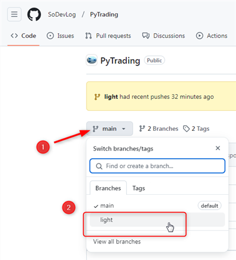

# TradingInPython - Trading Platform in Python

Here you can download the platform **TradingInPython** to make data analysis trading on stocks market.

This is the **lightweight** version to allow you a smaller download for your daily trading routine without making predictions.

# Install

First choose **"ligth"** branch to download :

1. Clic button that open branchs
2. Choose **light**

Just clic on **"<> Code"** then **"Download ZIP"** you will get the zip. Its a little long, about 200 Mo to download, but you'll get a stand alone executable. Nothing to install just run **TradingInPython.exe**

Once you get **PyTrading-light.zip** don't forget to **unlock** it before **extract all** where you want.

Inside folder **PyTrading-light** you'll find:
- TradingInPyhton
- README.md

Clic on directory **TradingInPyhton**

Then clic on executable **TradingInPython-Light.exe** then Trading Platform in python will launched.

## Clone

To make it easier to enjoy upcoming releases and software improvements, if you know GitHub you can make a Clone from this Repo.

To get new features you'll just had to make a Pull.

# Rapid Tour

You can have a rapid presentation of what you'll be able to do with the Trading platform, it's in french but you can translate easily by choosing your language in GoogleTranslate :

- [Rapid Tour of the Trading Platform in Python](https://www.trading-et-data-analyses.com/p/plateforme-de-trading-and-data-analyse.html)

You will be able to run the Ichimoku Kinko Hyo's strategie :

By running TradingInPyhton you will discover many others trading strategies.

# Documentation

You can easely translate this documentation in any langage you need, thanks to google translate.

- [Trading Platform's Documentation](https://www.trading-et-data-analyses.com/p/documentation-plateforme-de-trading.html)

# Release notes

Informations on the next version, by your feed back you can participate to the next version of the Tradnig Plateform.

- [Trading Platform's Release notes](https://www.trading-et-data-analyses.com/p/notes-de-publication.html)

# Get a free license

We need customers or partners to develop the Community of python traders and continue to develop of this platform **TradingInPython** and add new features.

By sending an email to : [plateforme@sodevlog.com](mailto:plateforme@sodevlog.com?subject=My%20license%20trading%20in%20python&body=Thanks%20to%20send%20me%20a%20license)

You'll get a **free license for 10 days**.

If you **do not receive** the automatic response with your license. Please wait a few time, we are processing your message and you will get a response.

If you include helpful feedback in your email, you may be able to get a more days license.

# Get your license

After the trial period you will need to get a license to continue using the platform.

- [Pay your subscription license](https://www.trading-et-data-analyses.com/p/abonnement.html)

You will receive it by email to activate your Trading platform.

# Requirements

- On Windows 7 you can try but most of the time you'll get error, so you need a Windows more than 7
- On MacOS and Linux you **must wait** a while, but remember Python is all platforms compatible

# Disclaimer

This software is provided "as is", without any express or implied warranties. The user assumes full responsibility for its use and any consequences that may arise. Under no circumstances shall the author or contributors be held liable for any direct, indirect, incidental, or consequential damages resulting from the use of this software.

The user is encouraged to verify the accuracy of the data and not to rely solely on the results provided by the software. Any commercial or financial use is at the user's own risk.

