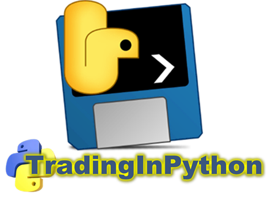

# TradingInPython - Trading Platform in Python

Free Open Software Plateform for traders who want to master technical trading.

  

Here you can download the platform **TradingInPython** to make data analysis trading on stocks market.

# Install

Just clic on **"<> Code"** then **"Download ZIP"** you will get the zip. Its a little long, about 400 Mo to download, but you'll get a stand alone executable. Nothing to install just run **TradingInPython.exe**

Once you get **PyTrading-main.zip** don't forget to **unlock** it before **extract all** where you want.

Inside folder **PyTrading-main** you'll find:

- TradingInPyhton
- README.md

Clic on directory **TradingInPyhton**

Then clic on executable **TradingInPython.exe** then Trading Platform in python will launched.

## Installer for windows

- [Installer](https://github.com/SoDevLog/PyTrading/releases)

You need help for installation have a look to :

- [Installation Guide](https://github.com/SoDevLog/PyTrading/wiki/Installation)

## Clone

To make it easier to enjoy upcoming releases and software improvements, if you know **GitHub** you can make a Clone from this Repo.

To get new features you'll just had to make a Pull wich is lighter than downloading the whole zip.

# Rapid Tour

You can have a rapid presentation of what you'll be able to do with the Trading platform, it's in french but you can translate easily by choosing your language in GoogleTranslate :

- [Rapid Tour of the Trading Platform in Python](https://trading-in-python.sodevlog.com/tour-rapide/)

You will be able to run the **Ichimoku Kinko Hyo's** strategie and prediction with [scikit-learn](https://scikit-learn.org/stable/index.html) :

By running **TradingInPyhton** you will discover many others trading strategies.

## Strategy Prediction with Keras

Perform technical analysis of stock market **deep learning** with [Keras](https://keras.io/)'s **neural networks** and [Jax](https://docs.jax.dev/en/latest/quickstart.html) :

Take a deep dive into digital signal processing with Keras prediction algorithms applied to the Ichimoku Kinko Hyo strategy:

- [Ichimoku Kinko Hyo prediction alorithms](https://github.com/SoDevLog/PyTrading/blob/main/TradingInPython/_internal/digitsignalprocessing/ichimoku_kinko_hyo.py)

Discover many others strategies while downloading and running the platform **TradingInPyhton**.

## Strategy Prediction with Kalman Filter

Perform trend and volatility analyses of stocks market with using Kalman Filter algorithm :

Take a deep dive into digital signal processing with Kalman filter trend prediction algorithms applied to trading strategy:

- [Kalman filter alorithms](https://github.com/SoDevLog/PyTrading/blob/main/TradingInPython/_internal/strategies/kalman_filter_forcast.py)

- [Kalman filter documentation](https://trading-in-python.sodevlog.com/strategies/kalman-filter/)

Discover many others strategies while downloading and running the platform **TradingInPyhton**.

# Documentation

You can easely translate this documentation in any langage you need, thanks to google translate.

- [Trading Platform's Documentation](https://www.trading-et-data-analyses.com/p/documentation-plateforme-de-trading.html)

## Open software

Python software distribution with **PyInstaller** is a very open system.

We publish TradingInPython's algorithms in directory:

- [Digital signal processing](./TradingInPython/_internal/digitsignalprocessing)

So you can take a look at the **platform engine** and understand in depth the indicators used in the trading strategies:

- [Digital signal processing/indicators.py](./TradingInPython/_internal/digitsignalprocessing/indicators.py)

### Automatic trading strategies in python

You can integrate your own trading strategies in the platform **TradingInPyhton**, by adding your own algorithms, this is how to do it.

Have a look and take example to the **trading strategies** used in the platform:

- [Strategy single moving average and exponential.py](./TradingInPython/_internal/strategy_sma12e.py)

Read the documentation on the plateforme's API :

- [Develop your strategy using TradingInPython's API](https://www.trading-et-data-analyses.com/p/strategies-dans-tradinginpython.html)

## Release notes

Informations on the **next version**, by your feed back you can participate to the next version of the Trading Plateform.

- [Trading Platform's Release notes](https://www.trading-et-data-analyses.com/p/notes-de-publication.html)

# Get a free license

We need customers or partners to develop the Community of python traders and continue to develop of this platform **TradingInPython** and add new features.

By sending an email to : [plateforme@sodevlog.com](mailto:plateforme@sodevlog.com?subject=My%20license%20trading%20in%20python&body=Thanks%20to%20send%20me%20a%20license)

You'll get a **free license for 10 days** more or less.

If you **do not receive** the automatic response with your license or if it's wrong due to your emailer, please, wait a few time, we are processing your message and you will get a response.

If you include **helpful feedback** in your email, you may be able to get a more days license.

# Get your license

After the trial period, you will need to obtain a license to use paid strategies.

- [Pay your subscription license](https://www.trading-et-data-analyses.com/p/abonnement.html)

You will receive it by email to activate your Trading platform.

# Requirements

- On Windows 7 you can try but most of the time you'll get error, so you need a Windows more than 7
- On MacOS and Linux you **must wait** a while, but remember Python is all platforms compatible

# Fundamental analysis

Algorithmic trading is great, but it's even better when it's confirmed by fundamental analysis.

Find algorithms that will enables you to perform accounting analysis of stocks market with **yfinance**.

- [Fundamental analysis](./TradingInPython/Z-Integration/yfinance)

# Disclaimer

This software is provided "as is", without any express or implied warranties. The user assumes full responsibility for its use and any consequences that may arise. Under no circumstances shall the author or contributors be held liable for any direct, indirect, incidental, or consequential damages resulting from the use of this software.

The user is encouraged to verify the accuracy of the data and not to rely solely on the results provided by the software. Any commercial or financial use is at the user's own risk.
